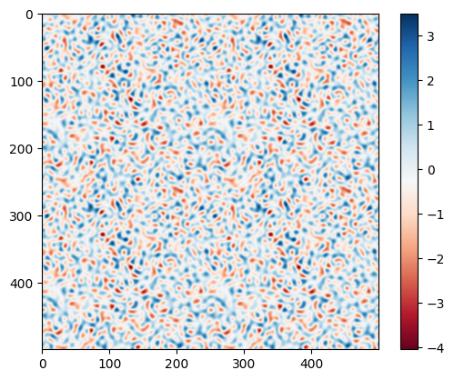

# Model Seminar SoSe2025

Topic: Hyperuniformity

There are hyperuniform point patterns in the point_patterns folder.
You can read a point pattern by simply using numpy.load. The shape will be (N, 2)
The parameters used for generating the point pattern are in parms.csv.

Explanation of files:

hu_nnufft_type3.ipynb
- the main script to be used to generate point patterns using nufft

hu_points.ipynb
- the naive implementation of point pattern generation
  
function_builder.ipynb
- simple notebook for visualising bump on the structure factor and plotting benchmark results
	
gaussian.ipynb
- prototype for generation of hu gaussian field
  
old_hu_nnufft.ipynb
- nufft using type 1 and type 2 nufft's (should not be used)

